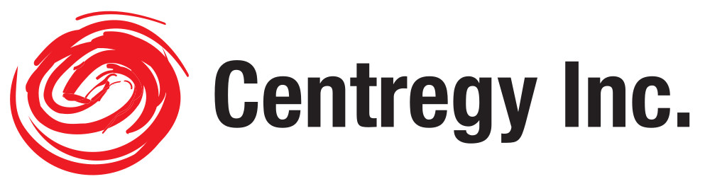

::: tip
  Who are we, where we operate, our clients
:::

## Who are we

Centregy has been operating for 10 years in Latin America.
The team members have working experience in various areas of the industry including operations, engineering, consultancy, marketing, sales and research & development.
This valuable work experience was built at corporations such as MCI International, NYNEX, Millicom International, Western and Wireless, Nokia, Ericsson, Marconi, AT&T Bell Laboratories, and operators in North America, CALA, Europe and APAC.

## About Us
Centregy is a services consulting firm specialized in:
temporary / contract staffing, permanent recruitment, search and selection, through to managed service programs and the provision of a reliable, high quality and cost effective alternative to in-house and/or outsourcing of personnel.
Centregy has devised innovative business Models to operate in any country in Latin America and has served Companies such as Marconi, MSI, Lemcom, Spring, OSC.

[blog](/blog/)

    

        
Grey

        

            Base
            #B8C2CC
        

    

    

        White
        #FFFFFF
    

